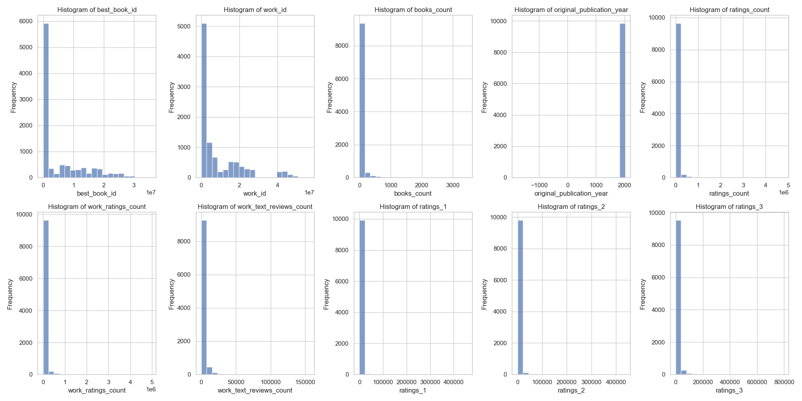

# Automated Data Analysis Report

**Title: Insights from the Written Word: A Deep Dive into Book Ratings Data**

**Introduction:**
In the vast universe of literature, readers often turn to platforms like Goodreads for guidance on what to read next. This analysis examines a dataset of 10,000 books to uncover trends and insights about reader preferences, author popularity, and the dynamics of book ratings. The dataset includes important variables such as book identification details, authors, publication year, language, average rating, and ratings distribution.

**Data Summary:**
The dataset contains various columns detailing each book's attributes, including:
- **Identifiers:** book_id, goodreads_book_id, work_id
- **Book Features:** authors, original_publication_year, language_code, average_rating
- **Ratings History:** ratings_count, work_ratings_count, work_text_reviews_count, ratings_1 through ratings_5

Some columns, such as ISBN and original_title, contain a notable amount of missing values, pointing to data collection challenges. Our review also finds that the average rating of the books is approximately 4.00, with a general distribution favoring higher ratings—indicative of a bias towards well-received books in the dataset.

**Descriptive Analysis:**
- **Rating Distribution:** 
  The average rating is around 4.00, with most ratings clustered towards the higher end. Notably, approximately 24% of ratings fall into the ‘5 stars’ category, while lower ratings are significantly less represented.
- **Popularity Metrics:**
  “Ratings count” and “work ratings count” showcase significant discrepancies, suggesting that while some books achieve high scores, they often have vastly different sample sizes of votes. The maximum ratings count reached an astounding 4.78 million, symbolizing exceptional popularity for select titles.

**Correlations and Insights:**
The analysis reveals several critical correlations:
- **Ratings Count vs. Work Ratings Count:** A strong positive correlation (0.995) indicates that books with a larger number of ratings tend to have a higher overall average rating. This suggests that widely read books are more frequently evaluated, possibly leading to a sampling effect in favor of popular titles.
- **Books Count and Ratings:** An interesting finding is the negative correlation (-0.264) between “books count” and average ratings. This reveals that books published in greater quantities (possibly by prolific authors) have slightly lower ratings on average, hinting at a potential dilution of quality or variance in reader engagement.
- **Language Count:** With 25 unique language codes, data points towards a diverse reading demographic. The highest frequency of books is in English (6341 entries), representing a significant skew that encourages further examination of the global reach of literature.

**Cluster Analysis:**
Further exploration through cluster analysis identifies three distinct groups:
1. **Cluster 0:** This is the largest group with 9967 books, predominantly characterized by average to high ratings and collections from many varied authors. 
2. **Cluster 1:** A smaller cluster with 24 entries consists of books with lower traffic, potentially indie or niche titles, reflecting unique themes or styles.
3. **Cluster 2:** Comprising only 9 books, this cluster likely represents outliers or extremely specialized titles achieving mass appeal.

**Implications and Recommendations:**
The findings have implications for authors, publishers, and marketers in the literary space:
- **Targeted Marketing:** Understanding the dynamics of popular titles and their ratings can help marketers target advertisements more effectively based on reading preferences and trends.
- **Feedback Loop for Authors:** Prolific authors might benefit from evaluating reader responses to their works; lower average ratings in high-output contexts could prompt a reassessment of quality versus quantity strategies.
- **Encouraging Diverse Reads:** By addressing the skew towards high-published English language titles, book clubs and reading platforms could foster a more diverse reading culture by highlighting lesser-known works.

**Conclusion:**
In a world where books serve as gateways to knowledge, adventure, and culture, analyzing reader data fosters deeper connections between literature and the audience. The insights gleaned offer a roadmap for future endeavors within the literary community, guiding stakeholders in crafting experiences that resonate with readers’ evolving tastes. Through continuous exploration of such datasets, we can further enrich our understanding of the literary landscape.

## Visualizations

