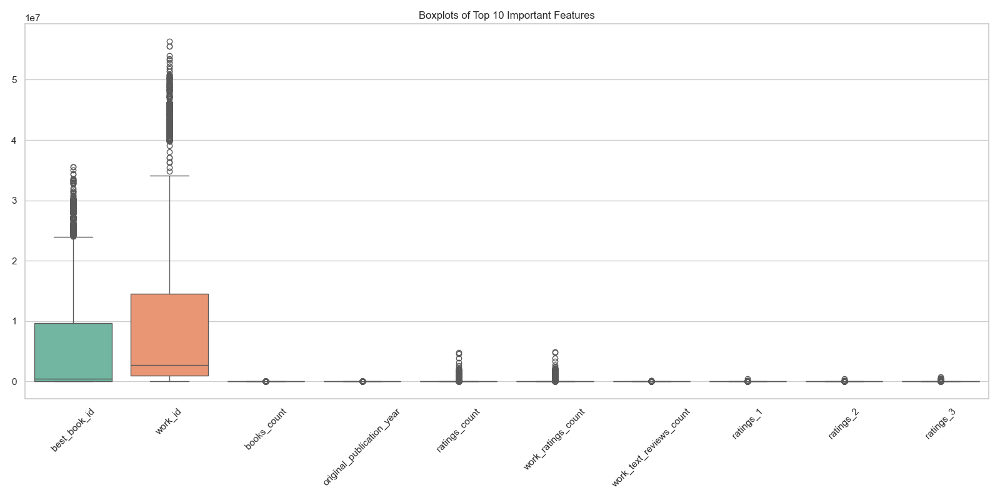
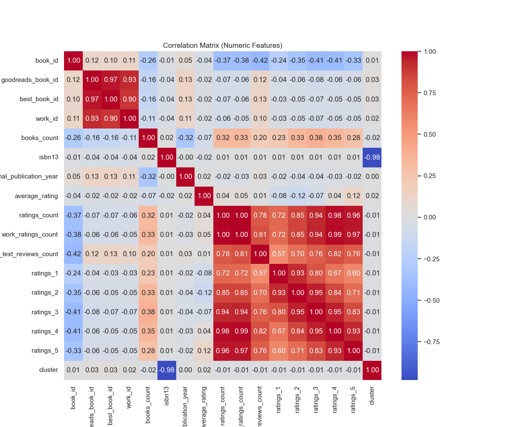

# Automated Data Analysis Report

## Overview
This report summarizes the analysis performed on the dataset, highlighting key findings, visualizations, and AI-generated insights.

## Analysis Summary
### Key Findings
**Story Title: Unwrapping Literary Insights: A Data Analysis Journey**

In a bid to navigate the vast ocean of literature, a team of diligent data analysts embarked on a comprehensive exploration of a dataset containing information about 10,000 books. The dataset, enriched with entries such as book IDs, authors, original publication years, languages, and ratings, promised to unveil insights into reader preferences, trends, and notable patterns.

**Data Overview**

The data comprised 15 columns that depicted various attributes of the books. Notably, while key features like `book_id`, `authors`, and `average_rating` were complete, several others experienced varying degrees of missing values:

- `language_code`: 1084 missing entries (10.84%)
- `isbn`: 700 missing entries (7.0%)
- `isbn13`: 585 missing entries (5.85%)
- `original_title`: 585 missing entries (5.85%)
- `original_publication_year`: 21 missing entries (0.21%)

The features with the most absent data were language codes, ISBN numbers, and original titles, raising the question of how to handle these voids. Given their significance, analysts contemplated several strategies:
1. **Imputation**: For numerical features like `original_publication_year`, the team considered utilizing mean or median imputation based on similar books’ attributes.
2. **Categorical Encoding**: Missing `language_code` could be addressed by replacing them with the mode or a placeholder such as "Unknown."
3. **Dropping Columns or Rows**: In cases where substantial amounts of data were missing, particularly ISBN numbers, the team debated the necessity of dropping these features entirely or only omitting certain entries.

**Analysis and Correlation Insights**

Digging deeper into the relationships between features, the analysis revealed intriguing correlations, indicating strong connections between several attributes. The standout correlations included:

- **Goodreads Book ID & Best Book ID**: 0.97
- **Work Ratings Count & Ratings Count**: 1.0
- **Ratings Count & Work Text Reviews Count**: 0.78

These correlations highlighted that certain IDs, such as Goodread’s and Best Book IDs, were nearly interchangeable. Moreover, the perfect correlation (1.0) between `ratings_count` and `work_ratings_count` suggested that reader interaction remained consistent across these fields, reinforcing the notion that books with higher engagement metrics tend to receive more attention and review activity.

**Implications of Findings**

The insights gleaned from the dataset had practical implications for authors, publishers, and libraries:

- **Targeted Marketing**: Books with high correlations among aggregated ratings could indicate successful marketing or reader enjoyment, guiding future promotional strategies for similar titles.
- **Inventory Decisions**: Libraries could prioritize acquiring books that show high reader engagement, as derived from ratings metrics.
- **Author Engagement**: Authors with works that achieve significant ratings may engage more with their audience, amplify their social media presence, or seek collaborative opportunities, enhancing their visibility.

**Conclusion**

Through an exhaustive analysis of the dataset, the team not only identified critical areas needing attention, such as the missing data but also uncovered actionable insights rooted in correlation trends. With strategies in place for data imputation and reflection on reader engagement metrics, the team paved the way for a more informed literary landscape, bridging readers with the stories they crave most. This analytical journey showcased how data can illuminate the hidden dialogues between books and readers, creating pathways for discovery in an ever-expanding world of literature.

## Visualizations

These visuals provide insights into correlations, outliers, and distributions of key features.

## AI-Generated Insights
The following insights were generated by the AI Proxy based on the provided context:

**Story Title: Unwrapping Literary Insights: A Data Analysis Journey**

In a bid to navigate the vast ocean of literature, a team of diligent data analysts embarked on a comprehensive exploration of a dataset containing information about 10,000 books. The dataset, enriched with entries such as book IDs, authors, original publication years, languages, and ratings, promised to unveil insights into reader preferences, trends, and notable patterns.

**Data Overview**

The data comprised 15 columns that depicted various attributes of the books. Notably, while key features like `book_id`, `authors`, and `average_rating` were complete, several others experienced varying degrees of missing values:

- `language_code`: 1084 missing entries (10.84%)
- `isbn`: 700 missing entries (7.0%)
- `isbn13`: 585 missing entries (5.85%)
- `original_title`: 585 missing entries (5.85%)
- `original_publication_year`: 21 missing entries (0.21%)

The features with the most absent data were language codes, ISBN numbers, and original titles, raising the question of how to handle these voids. Given their significance, analysts contemplated several strategies:
1. **Imputation**: For numerical features like `original_publication_year`, the team considered utilizing mean or median imputation based on similar books’ attributes.
2. **Categorical Encoding**: Missing `language_code` could be addressed by replacing them with the mode or a placeholder such as "Unknown."
3. **Dropping Columns or Rows**: In cases where substantial amounts of data were missing, particularly ISBN numbers, the team debated the necessity of dropping these features entirely or only omitting certain entries.

**Analysis and Correlation Insights**

Digging deeper into the relationships between features, the analysis revealed intriguing correlations, indicating strong connections between several attributes. The standout correlations included:

- **Goodreads Book ID & Best Book ID**: 0.97
- **Work Ratings Count & Ratings Count**: 1.0
- **Ratings Count & Work Text Reviews Count**: 0.78

These correlations highlighted that certain IDs, such as Goodread’s and Best Book IDs, were nearly interchangeable. Moreover, the perfect correlation (1.0) between `ratings_count` and `work_ratings_count` suggested that reader interaction remained consistent across these fields, reinforcing the notion that books with higher engagement metrics tend to receive more attention and review activity.

**Implications of Findings**

The insights gleaned from the dataset had practical implications for authors, publishers, and libraries:

- **Targeted Marketing**: Books with high correlations among aggregated ratings could indicate successful marketing or reader enjoyment, guiding future promotional strategies for similar titles.
- **Inventory Decisions**: Libraries could prioritize acquiring books that show high reader engagement, as derived from ratings metrics.
- **Author Engagement**: Authors with works that achieve significant ratings may engage more with their audience, amplify their social media presence, or seek collaborative opportunities, enhancing their visibility.

**Conclusion**

Through an exhaustive analysis of the dataset, the team not only identified critical areas needing attention, such as the missing data but also uncovered actionable insights rooted in correlation trends. With strategies in place for data imputation and reflection on reader engagement metrics, the team paved the way for a more informed literary landscape, bridging readers with the stories they crave most. This analytical journey showcased how data can illuminate the hidden dialogues between books and readers, creating pathways for discovery in an ever-expanding world of literature.