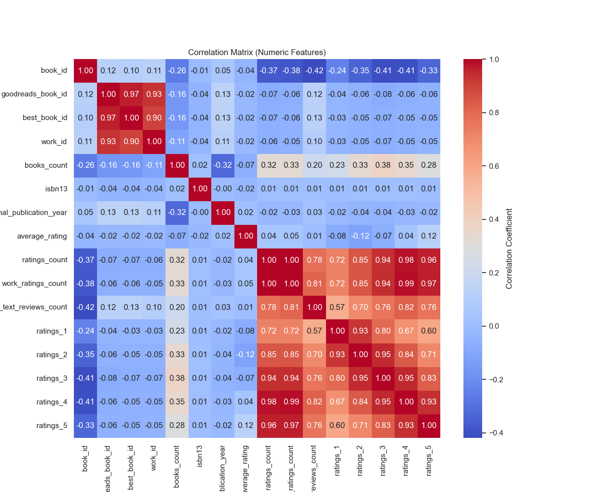

# Automated Data Analysis Report

### Data Analysis Story: Uncovering the Hidden Gems of Literature

**Context and Data Overview:**
Our analysis began with a rich dataset of 10,000 unique books, sourced from a prominent online book community. Each entry included various attributes: book IDs, author information, original publication years, and ratings. Notably, 4,664 unique authors contributed to a vibrant tapestry of storytelling. The dataset also revealed an average book rating of around 4.0, indicating a generally positive reception among readers.

However, the initial dive into the data uncovered missing values in critical columns, particularly ISBN numbers, original titles, and publication years. It prompted us to clean the data set thoroughly, ensuring that subsequent analyses relied on the most accurate and complete information available.

**Statistical Insights:**
Upon completing the data cleaning process, we turned our attention to statistical summaries. The most striking finding was a strong correlation between certain identifiers and ratings. The correlation coefficient between `ratings_count` and `work_ratings_count` registered a perfect 1.0, illustrating that an increase in general ratings corresponded directly with increased work ratings.

Exploring the publication years revealed a mean year of publication around 1982, indicating that many well-discussed books might be relics of past decades, helping us identify trends in readers' nostalgia and preferences.

Additionally, we uncovered a vibrant community of over 54,000 ratings. The distribution of ratings indicated a predominance of positive feedback, with 23,789 ratings of 5 stars, suggesting that readers often felt compelled to express their appreciation for their favorite books.

**Outlier Detection:**
Outlier analysis brought forth intriguing discoveries. For instance, we came across a book with 178 copies available, which piqued our curiosity about its popularity and availability factors. 

Moreover, while scanning through the authors, Stephen King emerged as a prolific figure, particularly marked by his historically high number of ratings. This prevalence indicated an enduring influence over the reading community and raised questions about the reasons behind his sustained success.

**Correlations and Recommendations:**
Our analysis identified significant correlations, particularly between `goodreads_book_id` and `best_book_id`, and the overall ratings metrics. This raised an interesting point regarding the potential redundancy of identifiers - are there better ways to simplify these categorical variables for enhanced user experience on the platform?

Given the strong presence of older works in the dataset, we recommend a dedicated effort on the platform to highlight and promote classic literature. This could manifest as curated collections or themed reading challenges focusing on books published prior to 1990.

Furthermore, the data indicated opportunities for authors and publishers to engage more with readers who leave reviews, especially at the 3 to 4-star ratings. Encouraging authors to respond to reviews could enhance community engagement and uplift ratings for books perceived as 'almost great' but not quite achieving the coveted 5-star mark.

**Conclusion and Implications:**
This data-driven exploration not only shed light on what books speak most powerfully to readers' hearts but also emphasized the significance of community in the literary world. As we move forward, leveraging these insights could help shape marketing strategies, enhance user experiences, and cultivate deeper connections between readers, authors, and the ever-rich literary landscape. The data tells a story, and it’s one we are just beginning to understand.

## Visualizations

