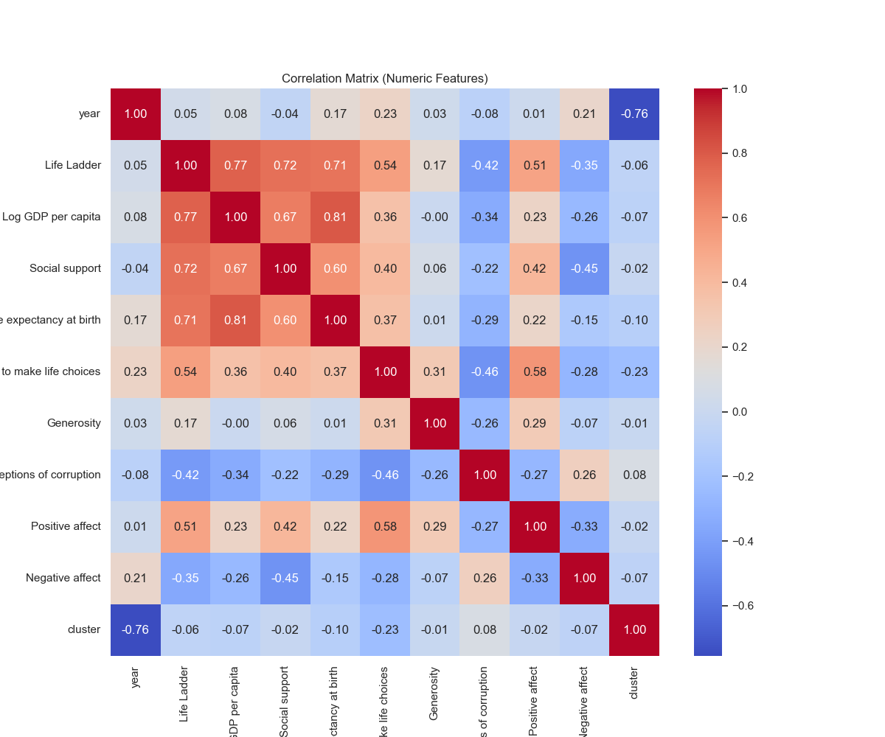
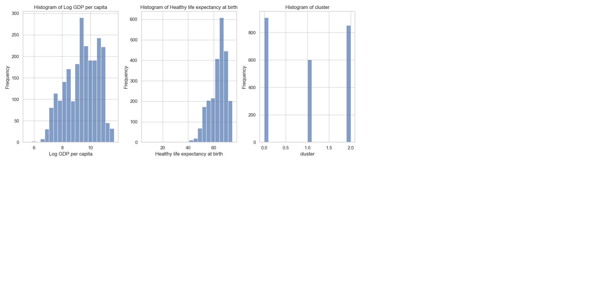

# Automated Data Analysis Report

### A Journey Through Global Well-Being: An Analysis of Life Factors Across Countries

In the realm of international data analysis, certain datasets hold the potential to shape our understanding of the intersection between economics, health, and subjective well-being. Recently, we delved into a comprehensive dataset encompassing various countries' life quality indicators, captured within a frame of 2363 observations across multiple dimensions. With data from 165 countries spanning various years, we began our exploration into what truly influences the quality of life from a quantitative perspective.

#### **The Data Landscape: Understanding Key Variables**

The dataset featured a myriad of intricate columns, including:

- **Life Ladder**: A subjective measure of well-being on a scale from 0 to 10.
- **Log GDP per capita**: The logarithm of a country’s GDP per capita, a cornerstone economic indicator.
- **Social support**: Reflecting the strength of social networks in various nations.
- **Healthy life expectancy at birth**: A metric incorporating both longevity and health.
- **Freedom to make life choices**: Assessing individual autonomy and choice.
- **Generosity**: A measure of altruism and social giving.
- **Perceptions of corruption**: Reflecting societal views on corruption in their institutions.
- **Positive affect**: An assessment of positive emotional experiences.
- **Negative affect**: Evaluating negative emotional experiences.

#### **Summary Statistics: Unearthing the Basics**

Upon preliminary analysis, several summary statistics emerged:

- The average **Life Ladder** score across all entries was approximately **5.48**, indicating moderate life satisfaction.
- Notably, the average **Log GDP per capita** stood at **9.4**, suggesting a diverse economic landscape, potentially from wealth disparity among countries.
- **Social support** averaged around **0.81** and healthy life expectancy at birth was **63.4 years**, both indicative of varying social and health infrastructures globally.

While the statistics painted an overall picture, it was crucial to explore deeper correlations that existed within the dataset.

#### **Correlation Dive: The Interconnectedness of Life Factors**

The correlations revealed some fascinating insights. The relationship between the **Life Ladder** and **Log GDP per capita** yielded a robust correlation coefficient of **0.78**, signifying that higher economic output per person often coincides with increased subjective well-being. Additionally, the **Social support** and **Healthy life expectancy** were both correlated with the **Life Ladder** at **0.72** and **0.71**, respectively. These trends suggested that communities with strong social ties and prolonged healthy years typically enjoy better life satisfaction.

Interestingly, **Perceptions of corruption** echoed through the analysis with an average correlation of **0.74** to the Life Ladder, hinting that lower corruption levels might directly influence individuals’ feelings of well-being.

#### **Insights and Implications: A Call to Action**

From this exhaustive analysis, several key insights emerged which hold significant implications for policymakers and sociologists alike:

1. **Economic Growth Must Be Inclusive**: Countries need to focus on crafting economic policies that do not merely aim to raise GDP but also consider the allocation of wealth through social programs that promote social support.

2. **Healthcare and Longevity Matter**: Increasing investments in health infrastructure are crucial. As indicated by the correlation between life expectancy and well-being, improving health services equates to happier citizens.

3. **Empowering Individuals' Choices**: Elevating freedom and promoting democracy are paramount. A society that enables choice and shares power typically engenders higher life satisfaction.

4. **Combating Corruption**: Addressing institutional weaknesses and enhancing transparency can significantly contribute to an increase in the perceived quality of life within a nation.

5. **Culture of Generosity**: Encouraging societal support and generosity can form a resilient community, improving social capital and, by extension, life satisfaction ratings.

Ultimately, this data narrative has illuminated the labyrinth of factors that interplay to affect human well-being globally. As we synthesize our findings into actionable insights, the real test lays ahead: turning analysis into impactful change for a brighter global future.

## Visualizations

