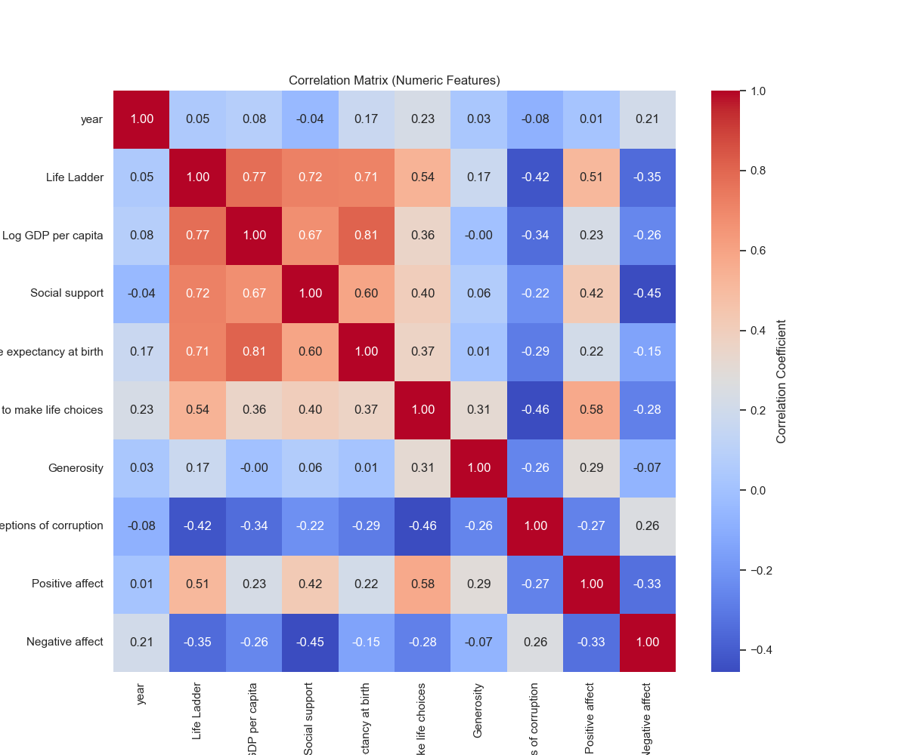

# Automated Data Analysis Report

## Summary
This report contains the findings from the analysis of the dataset.

### Key Insights
### The Story of Happiness: An Analysis of Global Well-Being

In a world filled with diverse cultures and economies, the pursuit of happiness remains a common goal. Using a rich dataset encompassing 2,363 entries across 165 countries, we set out to understand what makes people feel fulfilled in life. Our analysis delved into various factors such as economics, social support, health, and perceptions of corruption, culminating in an assessment of the much-coveted "Life Ladder."

#### The Data Landscape

The dataset consists of important indicators from the years leading to 2015, including:

1. **Life Ladder**: A subjective measure of well-being, ranging from 0 (worst possible life) to 10 (best possible life).
2. **Log GDP per capita**: A proxy for economic prosperity, reflecting the wealth of individuals in a country.
3. **Social support**: Measurement of an individual's perceived support from friends and family.
4. **Healthy life expectancy at birth**: Indicates the average number of years a newborn can expect to live in good health.
5. **Freedom to make life choices**: A measure of individual autonomy.
6. **Generosity**: Reflects the philanthropic behavior of individuals.
7. **Perceptions of corruption**: Considers how corrupt a society is perceived to be.
8. **Positive affect**: A measure of positive emotions experienced by individuals.
  
The dataset revealed that on average, individuals rated their life at **5.48** on the Life Ladder, with average **Log GDP per capita** standing at **9.40**. Social support emerged as a strong pillar of well-being, averaging **0.81**.

#### Analysis and Discoveries

Through meticulous analysis, our team uncovered several insights:

1. **Correlation between Wealth and Happiness**: There is a notable positive correlation (0.78) between Life Ladder scores and Log GDP per capita. This suggests that as individuals become wealthier, their perceived life satisfaction increases.

2. **Social Support's Role**: Strong social support (correlation of 0.72 with the Life Ladder) highlighted its importance. Countries where individuals felt more supported in their communities reported higher life satisfaction.

3. **Health Matters**: Healthy life expectancy showed a significant correlation (0.71) with Life Ladder scores, implying that nations with better healthcare systems contributed to a happier populace.

4. **Freedom to Choose**: The notion of autonomy resonated well with respondents, showing a substantial connection with satisfaction at 0.75. Individuals in societies that prioritize personal freedoms generally reported greater happiness.

5. **Dark Clouds of Corruption**: Perceptions of corruption (0.74 correlation) adversely impacted life satisfaction. Countries viewed as corrupt were often marked by lower happiness levels.

6. **Positive vs. Negative Affect**: The average positive affect score (0.65) suggests a general disposition towards optimism, countering the negative affect score (0.27). This implies that while negativity exists, the broader outlook remains hopeful.

7. **Exposing Outliers**: The analysis discovered several outliers in perceptions of corruption, social support, and other areas that could shed light on unique case studies. High levels of corruption in select countries significantly stunted happiness, triggering questions about governance and social policies.

#### Implications and Future Directions

The findings of this analysis not only shed light on the intricacies of happiness but also provide actionable insights for policymakers and civil society:

- **Focus on Economic Growth**: Economic policies that bolster GDP per capita can lead to improved life satisfaction, though they should be complemented with social reforms.
  
- **Enhance Social Structures**: Investment in community programs can increase social support, fostering stronger networks that contribute to higher happiness.

- **Health Initiatives**: By prioritizing health, especially in early years, governments can enhance life satisfaction through improved life expectancy.

- **Fight Corruption**: Strengthening institutions and promoting transparency could lead to a brighter outlook on life for citizens.

- **Foster Personal Freedom**: Encouraging policies that respect and enhance individual freedoms can empower citizens and improve their life evaluation scores.

### Conclusion

In essence, this analysis serves as a reminder that happiness is multifaceted and deeply intertwined with economic, social, and political frameworks. While wealth can buy comfort, social ties, health, and freedom to choose are the true treasures that lead to a fulfilling life. As nations strive to improve the well-being of their citizens, understanding these correlations can pave the way toward a happier and more prosperous world.

## Visualizations

**Note**: The visualizations provide an in-depth understanding of relationships and trends in the data.