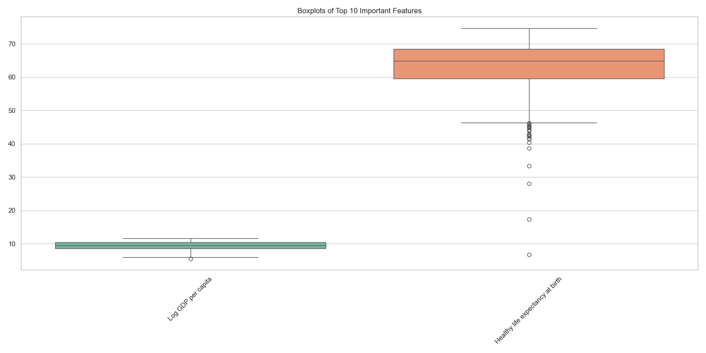

# Automated Data Analysis Report

## Overview
This report summarizes the analysis performed on the dataset, highlighting key findings, visualizations, and AI-generated insights.

## Analysis Summary
### Key Findings
**Title: The Relationships of Wellbeing: A Data-Driven Exploration**

**Introduction**  
As the world continues to evolve, metrics associated with happiness and wellbeing become paramount in understanding societal health. Our analysis delves into a comprehensive dataset exploring various indicators across different countries, focusing on the interrelations of GDP, social support, health expectations, corruption perceptions, and overall life satisfaction measured through the "Life Ladder."

**Dataset Overview**  
The dataset comprises 2363 observations spanning 165 countries between unspecified years, detailing multiple dimensions of wellbeing. Noteworthy columns include "Life Ladder," which quantifies life satisfaction, "Log GDP per capita," representing economic prosperity, and social metrics like "Healthy life expectancy at birth," "Freedom to make life choices," and "Generosity." 

- **Key Summary Statistics:**
  - Average Life Ladder Score: 5.48
  - Average Log GDP per capita: 9.40
  - Average Social Support: 0.81
  - Average Healthy Life Expectancy: 63.40 years
  - Average Freedom to Make Life Choices: 0.75
  - Average Perceptions of Corruption: 0.74
  - Average Positive Affect: 0.65

**Missing Data Analysis**  
While the dataset provides rich insights, it is also marred by missing values in critical areas:

1. **Perceptions of Corruption** - 125 missing values
2. **Generosity** - 81 missing values
3. **Healthy Life Expectancy at Birth** - 63 missing values
4. **Freedom to Make Life Choices** - 36 missing values
5. **Log GDP per Capita** - 28 missing values

**Handling Missing Data**  
There are several strategies to address the missing data:

- **Imputation**: Utilizing mean or median imputation for continuous variables or the mode for categorical variables to prevent loss of data.
- **Advanced Techniques**: Applying multiple imputation methods or machine learning models to predict missing values might yield more effective results.
- **Data Removal**: If a significant portion of data for a country is missing, consider excluding such cases from analysis to maintain data integrity.

**Correlation Analysis**  
Examining correlations provides insights into how various factors interlink:

- The strongest correlations identified were between:
  - Life Ladder and Log GDP per capita (0.78)
  - Log GDP per capita and Healthy life expectancy at birth (0.82)
  - Life Ladder and Social support (0.72)
  
The notable correlation of 0.82 between Log GDP per capita and Healthy life expectancy suggests economic stability is a significant driver of health outcomes. Similarly, the Life Ladder's close relationship with both GDP and Social support demonstrates how economic and social factors synchronize to influence life satisfaction.

**Insights and Implications**  
This exploration yields profound implications for policymakers and stakeholders:

1. **Economic Policies**: Enhancing GDP through strategic interventions can directly influence national happiness and health metrics.
2. **Social Programs**: Strong correlations between social support and life satisfaction underscore the importance of community and mental health programs in promoting public welfare.
3. **Corruption Awareness**: The nature of perceptions regarding corruption indicates a need for transparency in governance, as this also influences societal contentment.

**Conclusion**  
Through a meticulous analysis of a dataset measuring various indicators of wellbeing, it is evident that economic strength, social support, and health life expectancy are interconnected pillars influencing societal happiness. For future endeavors and research, handling the missing data and gaining a deeper understanding of these relationships could pave the way for more robust policies aimed at improving life satisfaction globally. This data-driven narrative serves as a roadmap to elevate societal wellbeing through targeted interventions.

## Visualizations

These visuals provide insights into correlations, outliers, and distributions of key features.

## AI-Generated Insights
The following insights were generated by the AI Proxy based on the provided context:

**Title: The Relationships of Wellbeing: A Data-Driven Exploration**

**Introduction**  
As the world continues to evolve, metrics associated with happiness and wellbeing become paramount in understanding societal health. Our analysis delves into a comprehensive dataset exploring various indicators across different countries, focusing on the interrelations of GDP, social support, health expectations, corruption perceptions, and overall life satisfaction measured through the "Life Ladder."

**Dataset Overview**  
The dataset comprises 2363 observations spanning 165 countries between unspecified years, detailing multiple dimensions of wellbeing. Noteworthy columns include "Life Ladder," which quantifies life satisfaction, "Log GDP per capita," representing economic prosperity, and social metrics like "Healthy life expectancy at birth," "Freedom to make life choices," and "Generosity." 

- **Key Summary Statistics:**
  - Average Life Ladder Score: 5.48
  - Average Log GDP per capita: 9.40
  - Average Social Support: 0.81
  - Average Healthy Life Expectancy: 63.40 years
  - Average Freedom to Make Life Choices: 0.75
  - Average Perceptions of Corruption: 0.74
  - Average Positive Affect: 0.65

**Missing Data Analysis**  
While the dataset provides rich insights, it is also marred by missing values in critical areas:

1. **Perceptions of Corruption** - 125 missing values
2. **Generosity** - 81 missing values
3. **Healthy Life Expectancy at Birth** - 63 missing values
4. **Freedom to Make Life Choices** - 36 missing values
5. **Log GDP per Capita** - 28 missing values

**Handling Missing Data**  
There are several strategies to address the missing data:

- **Imputation**: Utilizing mean or median imputation for continuous variables or the mode for categorical variables to prevent loss of data.
- **Advanced Techniques**: Applying multiple imputation methods or machine learning models to predict missing values might yield more effective results.
- **Data Removal**: If a significant portion of data for a country is missing, consider excluding such cases from analysis to maintain data integrity.

**Correlation Analysis**  
Examining correlations provides insights into how various factors interlink:

- The strongest correlations identified were between:
  - Life Ladder and Log GDP per capita (0.78)
  - Log GDP per capita and Healthy life expectancy at birth (0.82)
  - Life Ladder and Social support (0.72)
  
The notable correlation of 0.82 between Log GDP per capita and Healthy life expectancy suggests economic stability is a significant driver of health outcomes. Similarly, the Life Ladder's close relationship with both GDP and Social support demonstrates how economic and social factors synchronize to influence life satisfaction.

**Insights and Implications**  
This exploration yields profound implications for policymakers and stakeholders:

1. **Economic Policies**: Enhancing GDP through strategic interventions can directly influence national happiness and health metrics.
2. **Social Programs**: Strong correlations between social support and life satisfaction underscore the importance of community and mental health programs in promoting public welfare.
3. **Corruption Awareness**: The nature of perceptions regarding corruption indicates a need for transparency in governance, as this also influences societal contentment.

**Conclusion**  
Through a meticulous analysis of a dataset measuring various indicators of wellbeing, it is evident that economic strength, social support, and health life expectancy are interconnected pillars influencing societal happiness. For future endeavors and research, handling the missing data and gaining a deeper understanding of these relationships could pave the way for more robust policies aimed at improving life satisfaction globally. This data-driven narrative serves as a roadmap to elevate societal wellbeing through targeted interventions.