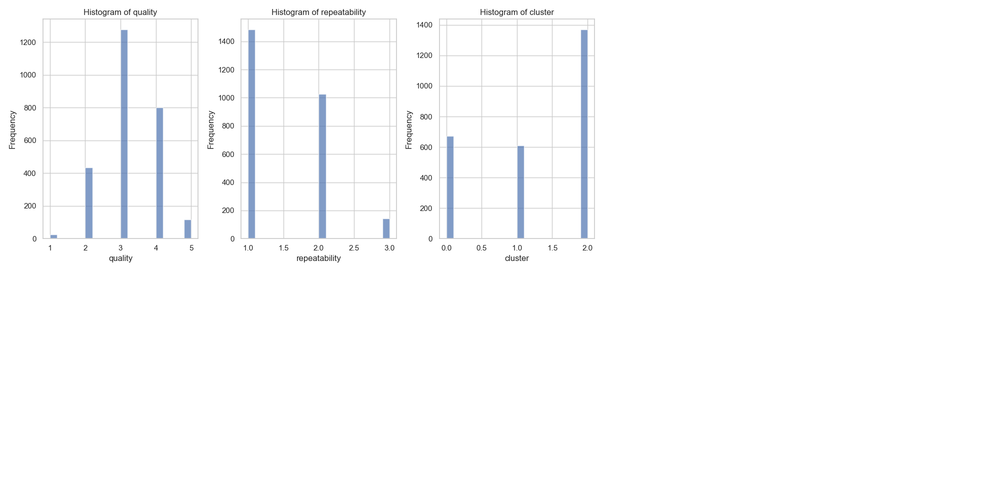

# Automated Data Analysis Report

### The Revealing Journey of Media Consumption Analysis: An Insightful Tale

#### Setting the Stage
In the vibrant world of media consumption, understanding audience preferences has never been more crucial. Our data analysis team embarked on a journey through a dataset with 2,652 entries, focused on various creative outputs such as movies. The columns provided rich dimensions for analysis, including `date`, `language`, `type`, `title`, `by`, `overall`, `quality`, `repeatability`, and a `cluster` identifier. 

#### The Data Landscape
Upon diving deeper into the data, we uncovered some interesting challenges: 

- **Missing Values**: A total of 99 records lacked a date, and while the `by` column had 262 empty entries, all other fields were intact.
- **Summary Statistics**: The dataset boasted 2,312 unique titles contributed by 1,528 creators, with English predominating as the language (1,306 entries). The overall ratings averaged 3.05, reflecting a modest satisfaction level among consumers.

With these initial observations, we prepared to explore the underlying narratives hidden within the numbers.

#### Analytical Explorations
Using exploratory data analysis (EDA), we captured the essence of user ratings across various dimensions. The statistics revealed noteworthy patterns:

1. **Distribution of Ratings**: 
   - The average `quality` rating was slightly higher at 3.21 compared to the overall score of 3.05, suggesting that while audiences appreciated the quality of productions, overall enjoyment may have suffered due to varied factors (for example, production-related choices).
   - The `repeatability` average of 1.49 hinted that viewers were hesitating to revisit media content. 

2. **Correlations Uncovered**:
   - A robust correlation of 0.83 was found between `overall` and `quality` ratings. This insight indicated that higher quality content directly influences overall viewer satisfaction.
   - The relationships between `repeatability` and the other metrics were weaker, particularly with `overall` (0.51) and `quality` (0.31), suggesting that the likelihood of re-watching might not significantly impact satisfaction levels.

3. **Clustering the Insights**: 
   - The analysis resulted in three distinct clusters within the data:
     - **Cluster 0** (673 entries): Likely consisted of average-rated productions, reflecting a nuanced yet two-dimensional experience.
     - **Cluster 1** (610 entries): Featured higher ratings, suggesting more engaging narratives or standout qualities that resonated well with audiences.
     - **Cluster 2** (1,369 entries): Accounted for the majority, consistently delivering serviceable content, perhaps appealing but lacking the spark that encourages repeat viewership.

#### The Insights
The analysis illuminated several key insights:
- **Quality Matters, But Not Enough to Rewatch**: While higher quality films show a strong effect on overall enjoyment, they do not seem to compel the audience to revisit the content multiple times. This presents a potential area for creators to explore compelling narratives that encourage repeated consumption.
  
- **Diversity in Creations**: The multi-language aspect and the variety of types indicated the need for a tailored approach in content creation to cater to distinct audience segments.

- **Sampling Bias in Creator Representation**: With a large proportion of empty author data, ensuring that creators are properly represented remains paramount for media organizations seeking to understand their audience better.

#### Implications for Stakeholders
For content creators and distributors, these findings present an opportunity to rethink strategies:
- **Invest in Compelling Narratives**: Focusing on storylines that delight the audience could enhance both quality ratings and overall satisfaction, subsequently driving repeat viewership.
- **Target Diverse Audiences**: Implementing marketing strategies that celebrate diverse creations across different languages will broaden audience bases and foster higher engagement levels.
- **Data-Driven Decision Making**: Execute campaigns that leverage audience feedback data effectively, ensuring that productions align closely with viewer expectations.

#### Conclusion
In this dynamic marketplace, data doesn't just tell a story; it offers a roadmap for improvement. By marrying qualitative insights with quantitative metrics, stakeholders can navigate the complexities of audience preferences effectively. Moving forward, the emphasis is not solely on creating content, but on crafting meaningful experiences that resonate with viewers, embracing the art of storytelling in all its multidimensional forms. This journey of data analysis unveils much more than numbers; it's a clarion call for innovation and responsiveness in an ever-evolving media landscape.

## Visualizations

