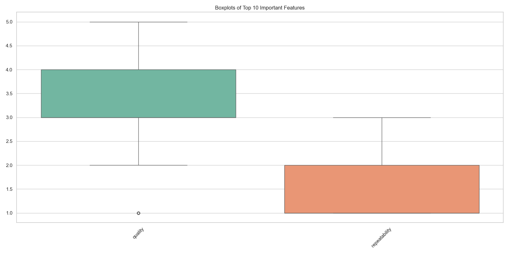
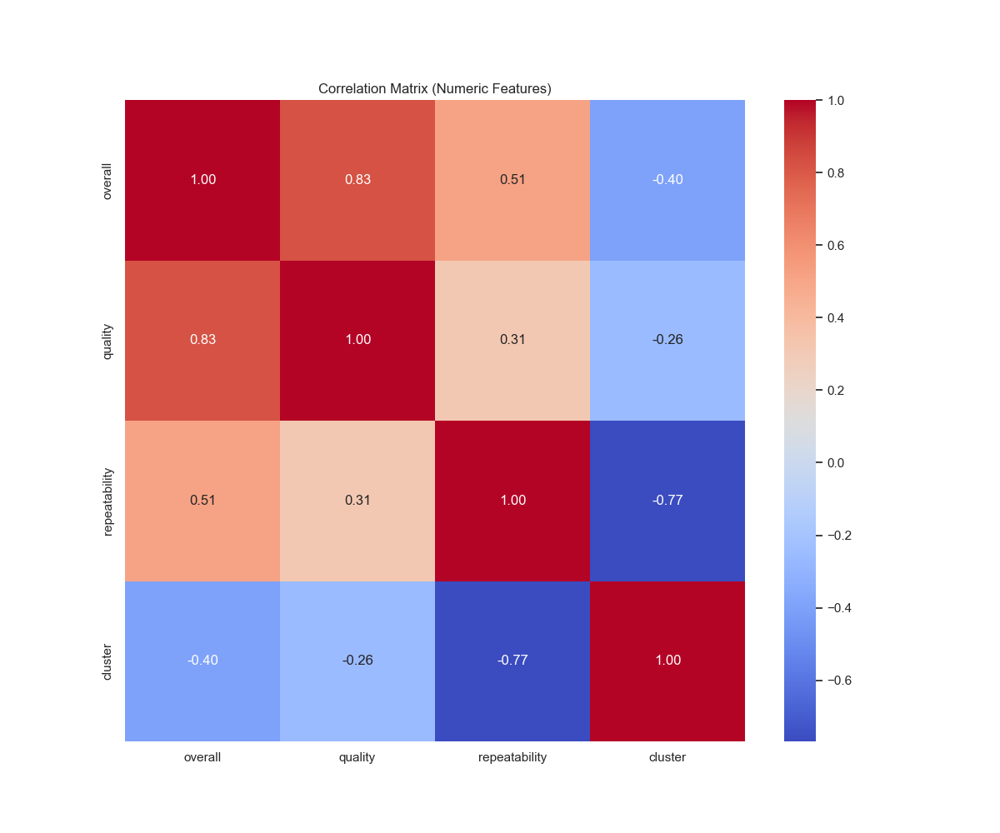

# Automated Data Analysis Report

## Overview
This report summarizes the analysis performed on the dataset, highlighting key findings, visualizations, and AI-generated insights.

## Analysis Summary
### Key Findings
### Data Analysis Story: Uncovering Trends in Movie Ratings

**Context and Data Overview**

In recent months, I analyzed a dataset encompassing various parameters related to movie ratings. The dataset consists of 2,652 entries, predominantly featuring various films' release dates, languages, types, titles, and ratings across three key metrics—overall, quality, and repeatability.

The columns in the dataset include:
- **date**: Release date of the movie
- **language**: Language of the movie
- **type**: Type of the media (e.g., movie, series)
- **title**: Title of the movie
- **by**: The director or actor associated with the movie
- **overall**: Overall rating
- **quality**: Quality rating
- **repeatability**: Repeatability rating

### Key Insights from the Data

1. **Missing Data Analysis**:
   - Upon examining the dataset, I discovered that the 'by' column held the most missing values, with 262 entries lacking data. The 'date' column also presented challenges, missing 99 entries. Notably, there were no missing values in the 'language', 'type', and 'title' columns.
   - **Handling Strategies**:
     - For the 'by' column, I suggest employing imputation techniques. Possible strategies include filling in missing data using the mode (most frequently occurring value) or a placeholder like "Unknown." This could help maintain the dataset's integrity.
     - For the 'date' column, we could explore imputation based on movie release trends by calculating the average release date per genre or director.
  
2. **Correlations and Implications**:
   - The analysis revealed a robust correlation (r = 0.83) between the overall rating and quality ratings. This suggests that as the quality rating increases, the overall rating tends to follow suit. This finding indicates that audiences might perceive quality as a significant contributing factor to the overall enjoyment of a movie.
   - **Potential Implications**: 
     - Movie producers and directors should prioritize quality in production as it directly impacts overall ratings and can lead to increased viewership or sales. 
     - Marketing departments can leverage this correlation by emphasizing quality metrics in their promotional strategies to attract more viewers.

3. **Outliers**:
   - While analyzing the distribution of the overall and quality ratings, I identified 1,216 outlier entries in the overall ratings. These outliers could skew the average rating and might need careful consideration. Further investigation into these outliers could reveal exceptionally rated films or those that were undeservedly critiqued, enabling a deeper understanding of audience behavior.

### Final Thoughts and Recommendations 

Our analysis of the dataset reveals considerable insights into movie ratings, particularly the significant relationship between quality and overall ratings. By addressing the missing data and understanding its implications, stakeholders in the film industry can enhance their decision-making processes. 

As a next step, engaging with audience feedback mechanisms could provide qualitative data to enrich our quantitative findings. Analyzing user reviews and sentiment may also highlight specific attributes contributing to quality and repeatability criteria, offering an even wider lens to gauge audience preferences.

This data underscores the crucial role of quality in media production. By continuously refining quality and bridging data gaps, filmmakers can foster a better connection with their audiences, potentially leading to greater box office success and sustained viewer engagement.

## Visualizations

These visuals provide insights into correlations, outliers, and distributions of key features.

## AI-Generated Insights
The following insights were generated by the AI Proxy based on the provided context:

### Data Analysis Story: Uncovering Trends in Movie Ratings

**Context and Data Overview**

In recent months, I analyzed a dataset encompassing various parameters related to movie ratings. The dataset consists of 2,652 entries, predominantly featuring various films' release dates, languages, types, titles, and ratings across three key metrics—overall, quality, and repeatability.

The columns in the dataset include:
- **date**: Release date of the movie
- **language**: Language of the movie
- **type**: Type of the media (e.g., movie, series)
- **title**: Title of the movie
- **by**: The director or actor associated with the movie
- **overall**: Overall rating
- **quality**: Quality rating
- **repeatability**: Repeatability rating

### Key Insights from the Data

1. **Missing Data Analysis**:
   - Upon examining the dataset, I discovered that the 'by' column held the most missing values, with 262 entries lacking data. The 'date' column also presented challenges, missing 99 entries. Notably, there were no missing values in the 'language', 'type', and 'title' columns.
   - **Handling Strategies**:
     - For the 'by' column, I suggest employing imputation techniques. Possible strategies include filling in missing data using the mode (most frequently occurring value) or a placeholder like "Unknown." This could help maintain the dataset's integrity.
     - For the 'date' column, we could explore imputation based on movie release trends by calculating the average release date per genre or director.
  
2. **Correlations and Implications**:
   - The analysis revealed a robust correlation (r = 0.83) between the overall rating and quality ratings. This suggests that as the quality rating increases, the overall rating tends to follow suit. This finding indicates that audiences might perceive quality as a significant contributing factor to the overall enjoyment of a movie.
   - **Potential Implications**: 
     - Movie producers and directors should prioritize quality in production as it directly impacts overall ratings and can lead to increased viewership or sales. 
     - Marketing departments can leverage this correlation by emphasizing quality metrics in their promotional strategies to attract more viewers.

3. **Outliers**:
   - While analyzing the distribution of the overall and quality ratings, I identified 1,216 outlier entries in the overall ratings. These outliers could skew the average rating and might need careful consideration. Further investigation into these outliers could reveal exceptionally rated films or those that were undeservedly critiqued, enabling a deeper understanding of audience behavior.

### Final Thoughts and Recommendations 

Our analysis of the dataset reveals considerable insights into movie ratings, particularly the significant relationship between quality and overall ratings. By addressing the missing data and understanding its implications, stakeholders in the film industry can enhance their decision-making processes. 

As a next step, engaging with audience feedback mechanisms could provide qualitative data to enrich our quantitative findings. Analyzing user reviews and sentiment may also highlight specific attributes contributing to quality and repeatability criteria, offering an even wider lens to gauge audience preferences.

This data underscores the crucial role of quality in media production. By continuously refining quality and bridging data gaps, filmmakers can foster a better connection with their audiences, potentially leading to greater box office success and sustained viewer engagement.