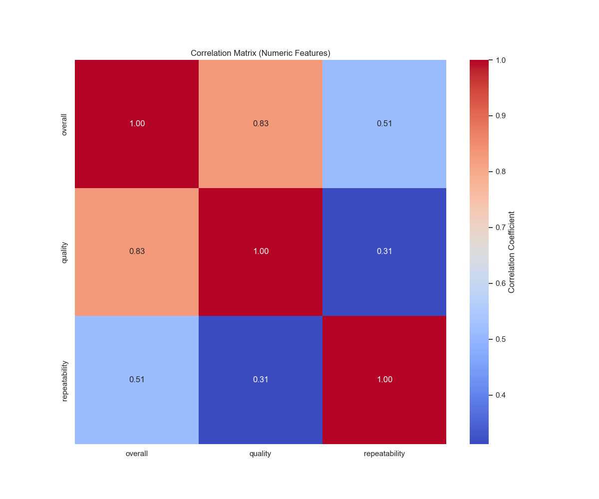

# Automated Data Analysis Report

### The Language of Film: A Data Analysis Journey

**Data Context and Exploration**

In the realm of film analytics, a recent dataset has emerged, serving as a vital resource for shedding light on various aspects of movies over time. The dataset, encompassing 2,652 entries, includes various columns such as date, language, type, title, creators, and multiple ratings—overall, quality, and repeatability. A closer examination reveals a rich tapestry of information waiting to be explored.

Each of the 2,553 recorded dates spans from an intriguing range, featuring notable frequency values, and revealing that the most frequently documented movie title is "Kanda Naal Mudhal," a work attributed to Kiefer Sutherland. Notably, the analysis highlights that English is the predominant language, present in over 1,300 instances, while the majority of movie entries categorized under the “type” are movies, featuring 2,211 occurrences.

**Statistical Insights**

Upon diving deeper into the statistical metrics, some compelling insights emerge:

- **Overall Ratings**: The average overall rating across all movies stands at approximately 3.05 out of 5, hinting at a moderately positive reception among viewers.
- **Quality Ratings**: Similar trends are observed with quality ratings, where the mean score is slightly higher at around 3.21. This correlation—highly significant at 0.83—implies that better quality productions tend to be favored more in terms of overall ratings as well.
- **Repeatability**: A unique metric, repeatability, averages around 1.49, suggesting that these films are not often viewed multiple times by audiences—a potential area for improvement regarding viewer engagement and satisfaction.

Given that missing values exist, particularly in the "by" column (where 262 entries are absent), it would be prudent for future analyses to address these gaps for a comprehensive understanding of the data.

**Clusters and Themes**

Potential clusters within the dataset hint at trends that could yield further insights. The categorization of films by dates or languages could illuminate whether certain types of films have enjoyed more success in specific eras or cultural contexts.

The dominance of English-language films emphasizes the potential biases in global cinema analytics. This raises questions about the underrepresentation of films in other languages, which may have been equally or more impactful but remain hidden from mainstream metrics due to insufficient data coverage.

**Implications for Stakeholders**

The findings from this analysis bear significant implications for various stakeholders in the film industry:

1. **Filmmakers and Producers**: Insights from the correlation between quality and overall ratings serve as a blueprint for production choices moving forward. A focus on crafting higher-quality films could translate directly into improved overall ratings, consequently enhancing profitability.

2. **Distributors and Marketers**: The repeatability scores indicate a need to focus efforts on building franchise value to encourage repeat viewership. Engaging marketing campaigns could reinvigorate interest in existing titles and generate buzz for upcoming releases.

3. **Cultural Analysts**: Understanding the predominance of English-language films urges cultural analysts to advocate for a broader representation of global cinema. Expanding the horizons of what's being analyzed could foster diversity in film appreciation.

4. **Consumers**: A push for transparency in quality metrics may empower consumers with knowledge and help guide their viewing choices more effectively.

**Conclusion**

In conclusion, the data analysis unveils a multifaceted view of cinematic trends through metrics of overall enjoyment, quality, and engagement. The correlations found alongside missing data create a clear directive for future research while shining a light on essential improvements. Embracing the depth of this dataset not only educates stakeholders but also enriches the ever-evolving narrative of film as an art form and a reflection of culture.

## Visualizations

